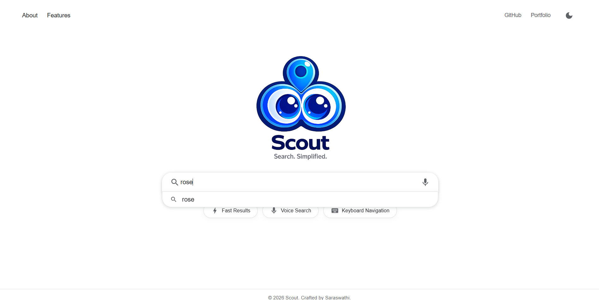
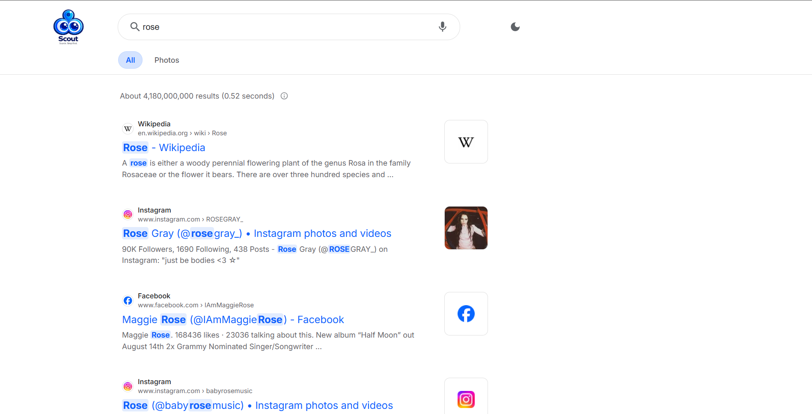
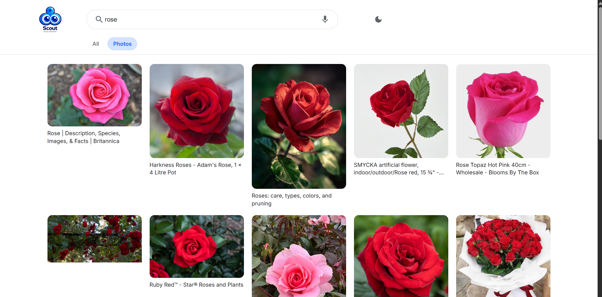

# 🔎 Scout | Search Simplified

> A modern search experience built with **React**, focused on clean UI, API integration, performance, and accessibility.

  <a href="https://scout-search-app.netlify.app/">🚀 Live Demo</a>
  &nbsp;•&nbsp;
  <a href="https://github.com/saraswathi22-mac/scout-search">💻 GitHub</a>

---

## ✨ Why Scout?

Scout was built as a practical **frontend engineering project** to explore how a real-world search experience can be designed and optimized using React.

It focuses on:

* ⚛️ Reusable React components
* 🔌 External API integration
* ⚡ Performance optimization
* ⌨️ Keyboard-friendly interactions
* 📱 Responsive UI
* 🎨 Clean and intuitive UX

---

## 🚀 Features

|     | Feature                                                                |
| --- | ---------------------------------------------------------------------- |
| 🔍  | **Web Search** — Search and view relevant results                      |
| 💡  | **Suggestions** — Debounced search suggestions                         |
| ⌨️  | **Keyboard Navigation** — Navigate suggestions using the keyboard      |
| 🖼️ | **Photos** — Browse image search results                               |
| ➕   | **Show More** — Load results incrementally                             |
| ⚡   | **Caching** — Reduce unnecessary API requests                          |
| 🎙️ | **Voice Search** — Search using voice input                            |
| 🌙  | **Theme** — Light & dark mode                                          |
| ⏳   | **Loading States** — Skeleton loading experience                       |
| ❌   | **Error & Empty States** — Clear feedback for failed or empty searches |
| 📱  | **Responsive** — Works across screen sizes                             |

---

## 🛠️ Tech Stack

**Frontend**

`React` · `JavaScript` · `HTML5` · `CSS3`

**Libraries & APIs**

`React Router` · `Material UI` · `Vite`
`Google Custom Search JSON API` · `Google Search Suggestions API`

---

## 💡 Engineering Highlights

### ⚛️ Custom Hooks

Search and image-search logic is handled through reusable custom hooks, keeping data-fetching and UI logic separated.

### ⚡ Debouncing & Caching

Debounced suggestions reduce unnecessary requests, while caching avoids repeated API calls for previously searched terms.

### ➕ Incremental Loading

Search and image results are loaded in controlled batches using **Show More** instead of loading everything at once.

### ⌨️ Keyboard Navigation

Search suggestions can be navigated and selected using keyboard controls for a smoother interaction.

### 🧩 Reusable Components

Reusable components are used for results, suggestions, loading, error, and empty states.

### 📱 Responsive UI

The interface adapts across desktop, tablet, and mobile screen sizes.

---

## 🎥 Demo

  

  <em>Watch the Scout demo to see the search experience in action.</em>

---

## 📸 Preview

  
  
  

---

  <a href="https://scout-search-app.netlify.app/">
    <strong>Scout | Search Simplified 🔎</strong>
  </a>

